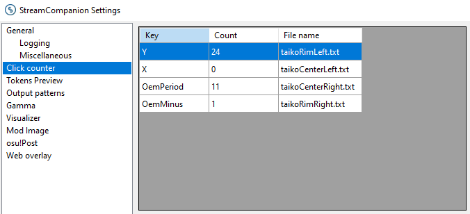

# StreamCompanion Taiko Keys Overlay

This repository contains an overlay for [Piotrekol's StreamCompanion](https://github.com/Piotrekol/StreamCompanion).
It provides an alternative key overlay that you can adjust to reflect your taiko keybinds.
For a demonstration, [check out the video in this tweet](https://twitter.com/taikohoot/status/1551617741311836162).
This overlay is based on [my StreamCompanion overlay template](https://gitlab.com/joogswastaken/streamcompanion-overlay-template).

## Installing the overlay

Simply download this repository.
You can do this by clicking the button next to "Clone" and selecting "zip", if you want to download the overlay as a zip file.
Extract it, and copy its contents into your stream overlay directory.
On Windows this is usually `C:\Program Files (x86)\StreamCompanion\Files\Web\overlays`.
You might want to rename the directory to something shorter like "TaikoKeys".

Open the settings file of your StreamCompanion installation.
On Windows, you can find it at `C:\Program Files (x86)\StreamCompanion\settings.ini`.
Change the MemoryPoolingFrequency setting to a low value, like 5.
What this will do is lower the interval in which StreamOverlay will check for new values provided by the osu! client.
This is important to get somewhat real-time key press events.
By setting it to 5, you're telling StreamCompanion to wait five milliseconds before fetching new updates.
Tinker with this setting and see if it affects your game's performance at all.

Start StreamCompanion.
Go to your settings and click on "Click counter".
One by one, click "Add key" for each key that you use to play taiko with.
Name the keys `taikoRimLeft`, `taikoCenterLeft`, `taikoCenterRight` and `taikoRimRight` respectively.
By the end, your settings should look like this.



Open your osu! client and start playing any map.
Open your browser and navigate to http://localhost:20727/overlays/TaikoKeys/ (if you named the directory "TaikoKeys").
Hit some of your keys and see if the overlay reacts to your inputs.

In your OBS, you can now add a new browser source and point it to the URL shown above.
Change the width and height as you see fit to make it complement your stream layout.

## Configuring the overlay

You can make adjustments to your overlay by editing the [config.json](./config.json) file.
If you make any changes to the config file, make sure to reload your browser source to reflect the changes.

### `keys`

`keys` is a name-value mapping.
If you named your click counters differently, you can change them in the config here.
Say you named the counter for your left rim key `myCenterLeft`, then you have to adjust the config like so.
(The rest of the config is removed for brevity.)

```json
{
    "keys": {
        "centerLeft": "myCenterLeft.txt"
    }
}
```

### `layout`

`layout` reflects your playstyle.
By default, the overlay is configured with a KDDK key layout.
If you play DDKK for example, you can adjust the config like so.

```json
{
    "layout": ["centerLeft", "centerRight", "rimLeft", "rimRight"]
}
```

### `colorDon` and `colorKat`

These are hex-coded colors reflecting the color of the center and rim (don and kat) keys respectively.
By default, the colors are `#aa321f` for dons and `#2b5b6e` for kats.

### `fadeOutMillis`

This is the amount of milliseconds that it should take for a key to fade out after it's been hit.
By default, this is set to 300 milliseconds.

### `debug`

Toggle it on.
I dare you.
Find out what happens.

## License

MIT.